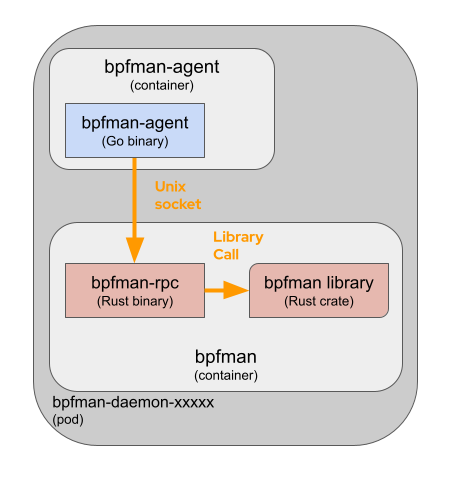

# bpfman Overview

Core bpfman is a library written in Rust and published as a Crate via crates.io.
The `bpfman` library leverages the `aya` library to manage eBPF programs.
Applications written in Rust can import the `bpfman` library and call the
bpfman APIs directly.
An example of a Rust based application leveraging the `bpfman` library is the
`bpfman` CLI, which is a Rust based binary used to provision bpfman from a
Linux command prompt (see [CLI Guide](./cli-guide.md)).

For applications written in other languages, bpfman provides `bpfman-rpc`, a Rust
based bpfman RPC server binary.
Non-Rust applications can send a RPC message to the server, which translate the
RPC request into a bpfman library call.
The long term solution is to leverage the Rust Foreign Function Interface (FFI)
feature, which enables a different (foreign) programming language to call Rust
functions, but that is not supported at the moment.

The `bpfman-rpc` server can run in one of two modes.
It can be run as a long running process or as a systemd service that uses
[socket activation](https://man7.org/linux/man-pages/man1/systemd-socket-activate.1.html)
to start `bpfman-rpc` only when there is a RPC message to process.
More details are provided in [Deploying Example eBPF Programs On Local Host](./example-bpf-local.md).

When deploying `bpfman` in a Kubernetes deployment, `bpfman-agent`, `bpfman-rpc`, and the
`bpfman` library are packaged in a container.
When the container starts, `bpfman-rpc` is started as a long running process.
`bpfman-agent` listens to the KubeAPI Server and send RPC requests to `bpfman-rpc`, which
in turn calls the `bpfman` library to manage eBPF programs on a given node.

More details provided in [Deploying Example eBPF Programs On Kubernetes](./example-bpf-k8s.md).
